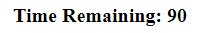
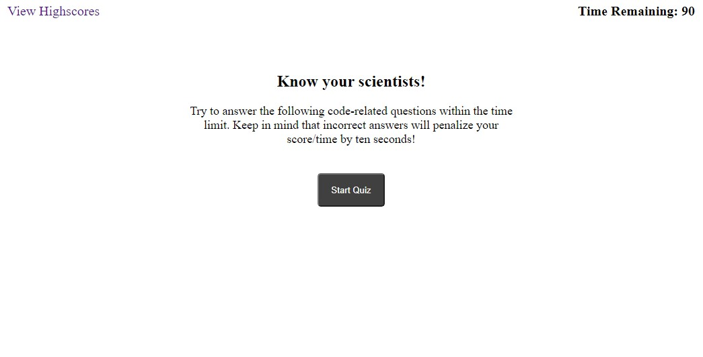
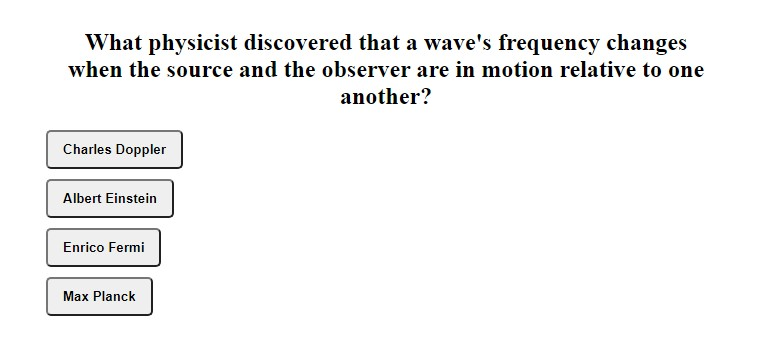
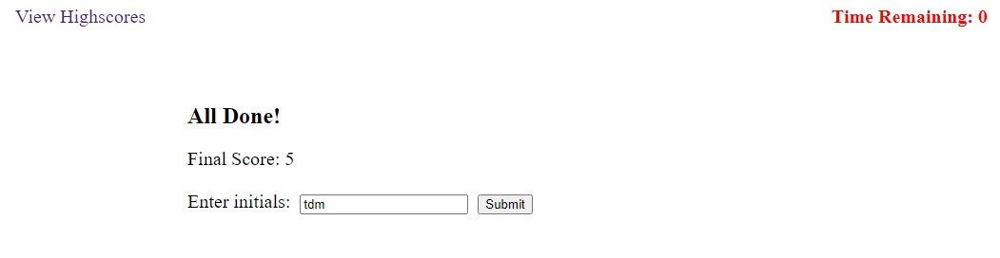
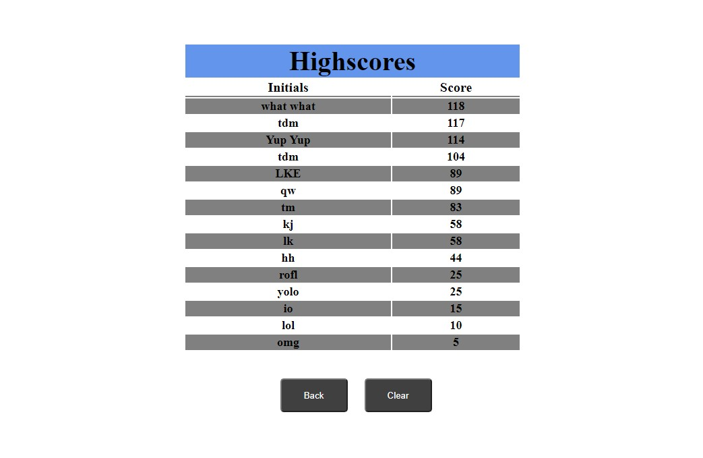

# Science Quiz

## Description

A science quiz that cycles the questions using JavaScript by manipulating the HTML, creating and deleting elements, changing styles, and adding attributes.

## Usage

The test is timed.  the timer is in the upper right corner. You have 90 seconds to answer 10 questions about scientists.

Click the start button to begin.  Once you click the start button the timer begins. 

Answer the questions by clicking the answer.  If you answer incorrectly, the timer is decremented by 10 seconds.  Answer correctly and you get 5 points.

Your time remaining is added to your score at the end.  Once the game is over the user may enter their initials and click submit to be added to the highscore board.  
  

On the highscore page, the back button takes you back to the main quiz and the clear button clears the highscores from local storage.

## Links

Github link: https://github.com/TimMartin13/quiz

Published link: https://timmartin13.github.io/quiz/
